-   **Project name**: Heating System Simulation
-   **Class**: 4IT496 (WS 2015/2016)
-   **Author**: Bc. Martin Knapovský
-   **Model type**: System dynamics
-   **Software used**: Vensim PLE - Windows version
-   **Date**: 28.12.2015

------------------------------------------------------------------------


# Introduction

Most households in the Czech Republic have mains gas central heating.
This is a so-called 'wet system', which means a gas-fired boiler heats
water to provide central heating through radiators and hot water through
the taps in your home. Some houses that aren't connected to the gas
network can use electrical heating or liquid petroleum gas (LPG) or
heating oil, which work in a similar way to gas central heating,
although LPG and oil are delivered by road and stored in a tank, which
you may have to buy or rent from your supplier. Gas is a highly
efficient fuel, so you get a good return on every unit of energy. Modern
condensing boilers, which use hot flue gases that are wasted in a
standard boiler, have very high efficiency. Some are now 90% or more
efficient.

I have recently acquired condensing boiler and i wanted make a
simulation of heating system for measuring approximate amount of gas
burned during 4 months. This period has been shortened to 1 month,
because there is no external variable that would change outside
temperature and therefore system would behave in a same manner. There
has also been problem with excessive amount of data (more information
under model description). I also wanted to know how to set our
thermostat, so that it is not so cold in private rooms.

# Problem definition


## People

There are 6 people using this flat. Each person periodically comes and 
leaves.

-   Pair 1 comes on monday and leaves on Wednesday
-   Pair 2 comes on monday and leaves on Friday
-   There are also 2 boys sharing another room - The first one stays
    here for the whole week and the second one leaves on Saturday and
    comes on Monday.

## Gas boiler

We own 25kW condensing boiler with 95% efficiency. Boiler is controlled
by thermostat.

## Thermostat

Thermostat is placed in the living room - it is set to 22 degrees
Celsius from 7:00 to 23:00 and to 19 degrees Celsius from 23:00 to 7:00.

## Rooms

There are 3 separated rooms used privately, one living room, kitchen,
bathroom, storage room and toilet. He have high ceilings, so volume of
rooms is really big.

-   Private rooms - 84mˆ3 x 3
-   Living room - 168mˆ3
-   Kitchen - 84mˆ3
-   Bathroom - 21mˆ3
-   Storage room - 21mˆ3
-   Toilet - 21mˆ3

Each room has different coefficient of ventilation - windows are
different, placement is different - for example there are no windows in
living room and there is window in bathroom that is often opened,
because someone just took shower.

## Radiators

We have old radiators made from cast-iron. Each part of this radiator is
600mm high and 200mm deep, its surface is 0,31mˆ2, its capacity is 1,7L.
Each room (except storage room) has its own radiator. In total, there
are 5 radiators with 30 parts and 2 radiators with 15 parts.

## Heating system

Consists of radiators and tubes. Total amount of water inside heating
system is 255L (5 big radiators) + 51L (2 smaller radiators) + 61L
(Amount of water inside tubes - 108m of tubes in total) = 367L. There is
also need to define settings of heating system. Our heating system is
designed in a way that water is heated up to 50 degrees celsius - this
is the point where gas boiler stops and energy accumulated within water
is distributed.

# Method

I have chosen Vensim for modelling **system dynamics**. I must say, that
this software is subjectively user-unfriendly - changing the model is
quite difficult due to necessity of usage of all variables defined in
model - there can\'t be any variable that is not used. The same goes for
usage of those variables inside equations - if there is a link, you have
to use your variable inside equation - Vensim requires clean model -
that is good for final release, but not for development. Versions for
windows and mac (that i own) behaves in a different way. On Mac OS X,
there is problem in editing properties of variables and links - software
is buggy (version 6.3 PLE). I have solved this problem by creating
virtual machine and installing Windows XP. On this system, everything
worked fine. (Notes for potential students using Vensim)

# Model

In this description, I will go through model settings, model overview
and then I will describe model segments.

## Global model settings

Due to need of some universal time step for implementing physical laws
into model, I have chosen **1s step**. One second is basic unit of SI
system, therefore physical equations and derived physical units are
using this time-length. Model starts at time-step 0 and end at time-step
2592000, which means that this abstract system dynamic model runs for 1
month (30 days) or real time.

## Model overview

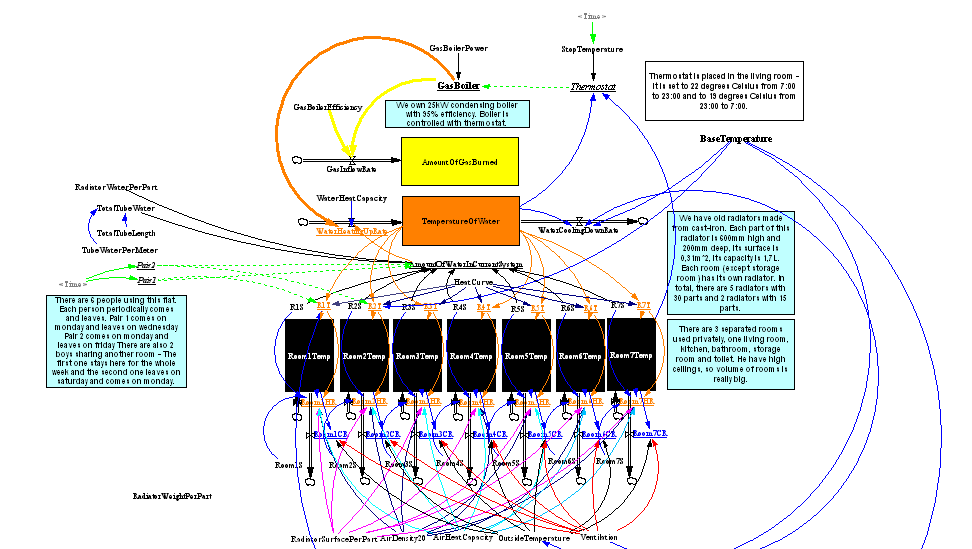

### Model parameters

As you can see, model is quite complex - it is mainly due to model
versatility - it is possible to set various model properties:

-   **Gas boiler power** - default power is 25000J (25kW)
-   **Gas boiler efficiency** - default efficiency is 95%
-   **Water heat capacity** - in real environment, water heat capacity
    slightly changes according to temperature. In this model, water heat
    capacity stays the same all the time - it can be changed manually -
    default value is 4181J.kgˆ(-1).Kˆ(-1) - it means, that 1kg of water
    needs 4181 Joules to increase its temperature by 1 Kelvin.
-   **Total tube length** - length of tubes in our apartment - default
    value is 108m
-   **Tube water per meter** - default value is 0.58L
-   **Heat curve** - difference between water temperature and radiator
    temperature - this variable is set according to heating system
    design - its default value is 0.8 (circulating water has 50
    degrees C. -\> radiator has 40 degrees)
-   **Room1S - Room7S** - room sizes - Room1 - Room4 has 83mˆ(3), Room5
    and Room6 has 21mˆ3, Room7 (living room with thermostat) has 168mˆ3
-   **R1S - R7S** - radiator sizes - R1 - R5 are radiators with 30
    parts, R6 and R7 are radiators with 15 parts
-   **Radiator surface per part** - this variable is needed to compute
    radiated energy - default value is 0.31mˆ2
-   **Air density** - default value is 1.2 kg.mˆ(-3)
-   **Air heat capacity** - default value is 1000J.kgˆ(-1).Kˆ(-1)
-   **Outside temperature and Base temperature** - default value 10
    degrees Celsius
-   **Ventilation coefficient** - used for computing heat decrease
    inside rooms (each room has different multiplier)

### Global system dynamics

Thermostat switches gas boiler on and off according to temperature in
living room and water temperature. According to the people in the flat,
radiators are turned on or off and amount of circulating water changes -
this affects effectivity of heating (more water, slower temperature
increase). Gas boiler heats-up water and this water is distributed
through the system. With respect to Stefan-Boltzman law, heat is
radiated into room and air temperature inside room changes. Accumulated
heat stays in heating system and inside rooms and slowly degrades.
Thermostat stops heating system when temperature requirements are
satisfied. The system doesn\'t count with using hot water for shower.

## From boiler to water

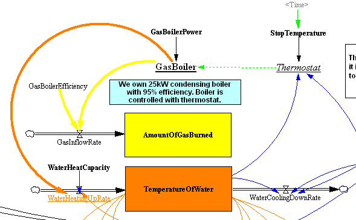

### Thermostat

Thermostat is placed inside the living room - it is set to 22 degrees
Celsius from 7:00 to 23:00 and to 19 degrees Celsius from 23:00 to 7:00.
These settings are triggered by variable called **StopTemperature** with
this setting\
`IF THEN ELSE(MODULO(Time, 86400) > 25200 :AND: MODULO(Time, 86400) < 82800, 22, 19)`
86400 is time in seconds - one day, 25200 corresponds to 7:00 and 82400
corresponds to 23:00.

Thermostat activates gas boiler only when there is low temperature in
living room and when circulating water temperature is below 50 degrees
Celsius.\
`IF THEN ELSE(Room7Temp < StopTemperature :AND: TemperatureOfWater < 50, 1, 0)`

### Pairs

Pair2 and similarly Pair1 generates discrete function with periodicity
of 1 week (604800 seconds).\
`IF THEN ELSE(MODULO(Time, 604800) >= 0 :AND: MODULO(Time, 604800) <= 432000, 1, 0)`

### Gas boiler 

Gas boiler runs only when thermostat generates high state.\
`IF THEN ELSE( Thermostat = 1 , GasBoilerPower, 0)`

### Amount of circulating water

Amount of water changes according to Pair1 and Pair2 state. Boys
doesn\'t affect system, because boy 1 is always present - radiators
R3-R7 are always active.\
`(IF THEN ELSE(Pair1 = 1, R1S*RadiatorWaterPerPart, 0)) + (IF THEN ELSE(Pair2 = 1, R2S*RadiatorWaterPerPart, 0)) + R3S*RadiatorWaterPerPart + R4S*RadiatorWaterPerPart + R5S*RadiatorWaterPerPart + R6S*RadiatorWaterPerPart + R7S*RadiatorWaterPerPart + TotalTubeWater`

### Gas inflow rate 

Inflow rate is increment of burnt gas per 1s. We have 25kW gas boiler
with 95% efficiency.\
`GasBoiler*(1/GasBoilerEfficiency)`

### Amount of gas burned 

Total amount of gas burned is integration of gas inflow rate over time.
It is in Joules. Initial value is 0J.\
`INTEG(GasInflowRate), E0=0`

### Water heat-up rate 

Heat up rate is increment of water temperature per 1s in degrees
Celsius. If there is more water in the system, then increment is lower
and vice versa. Gas boiler gives energy in Joules, that is accumulated
in current amount of water. 1kg of water needs 4181 Joules to increase
its temperature by 1K (correlation of K and C is linear - we can say
that 1K increase is the same as 1C increase).\
`(GasBoiler / (WaterHeatCapacity * AmountOfWaterInCurrentSystem))`

### Water cooling-down rate 

Water naturally loses its accumulated energy - environment is colder -
temperatures are being equalized, water capacity is roughly 10 times
higher.\
`((TemperatureOfWater-BaseTemperature)*Ventilation)/10`

### Temperature of water 

Water accumulates temperature increments. Temperature starts at
BaseTemperature (10 degrees Celsius by default).\
`INTEG((WaterHeatingUpRate-WaterCoolingDownRate)), T0 = BaseTemperature`

## From water to air 

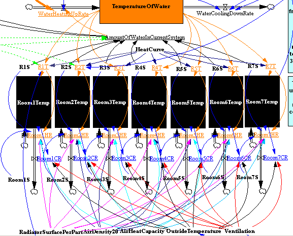

### Radiators 

There are 2 radiators, that can be closed a 5 radiators that are always
opened. Temperature of radiator is correlated to temperature of
circulating water. Iron heat capacity is lower than water heat capacity
(400J.kgˆ(-1).Kˆ(-1) vs 4168J.kgˆ(-1).Kˆ(-1)), thus radiator itself
cannot have higher temperature than water. Temperature of water is
multiplied by HeatCurve coefficient as mentioned earlier.\
`IF THEN ELSE(Pair1=1, TemperatureOfWater*HeatCurve, BaseTemperature)`

### Room heat-up rate 

Each room has its own heat up rate. This heat-up rate depends on size of
radiator inside room and Stefan-Boltzman law for heat radiation.
Radiated energy is distributed to rooms - each room has its own size
(volume), air has different heat capacity, so we have to take it into
account. Number 5.67 is Stefan-Boltzman constant.\
`(((R1S*RadiatorSurfacePerPart)*(5.67)*((273.4+R1T)^4)*10^(-8))/(Room1S*AirDensity20)/AirHeatCapacity)`

### Room temperature 

Room heat-up rate is integrated over time. Environment affects air
inside rooms and room gets colder. This model has hardwired condition
that air cannot be hotter than radiator.\
`IF THEN ELSE(Room1Temp + (Room1HR-Room1CR) < R1T, Room1HR-Room1CR, 0)`

### Room cool-down rate 

Room environment causes room temperature to decrease over time. Each
room is different. I have tried to reflect this fact into constants I
have used in cool-down rate computation. I have measured temperature
inside each room and then i have set constants according to what I have
found. The higher temperature of the room, the higher effect its
environment has.\
`(Room1Temp-OutsideTemperature)*Ventilation*6`

-   Room 1-4 - 6
-   Room 5 - 12
-   Room 6 - 6
-   Room 7 - 1

This also models weights of each room affecting living room with
thermostat.

# Results

## Thermostat switching 

Thermostat and gas-boiler switches between 0 and 1 all the time - real system behaves the same way - system always compensates for energy losses. There is no delay in this system, so switching happens instantly. 

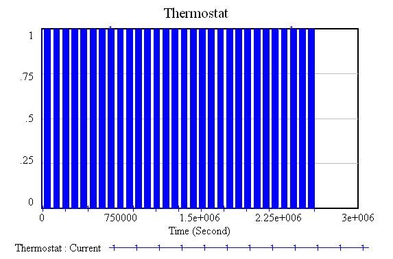 

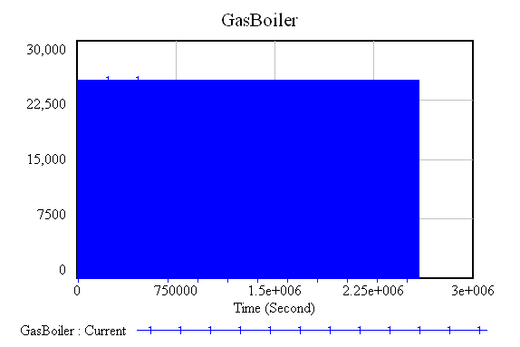

## Gas burned 

By changing model parameters, i have tried to find leverage point - most
sensitive parameters are outside temperature and ventilation
coefficient. By changing temperature from 10 degrees Celsius to 0
degrees Celsius, amount of gas burned doubles.

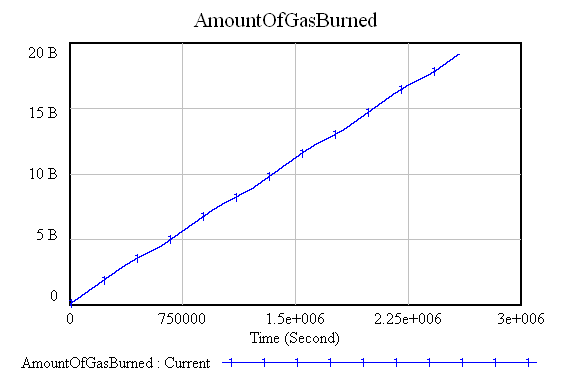
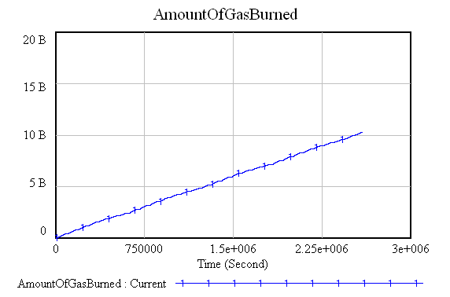

## Water temperature 

Water temperature changes according to the needs of heating system. When
there is 0 degrees Celsius outside, gas boiler keeps circulating water
heated to 50 degrees Celsius. 
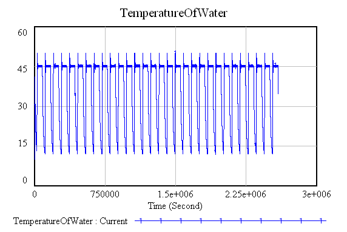
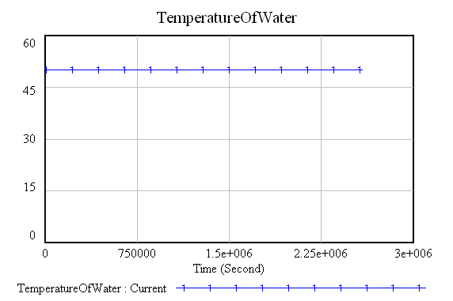

## Water heating up rate 

Heating-up rate changes according to pair 1 and pair 2 leaving and
returning. 

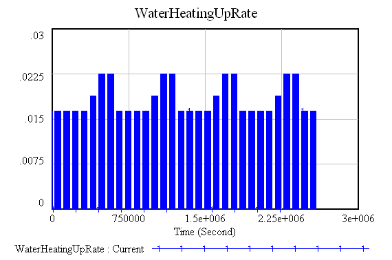 

So does amount of the circulating water. 

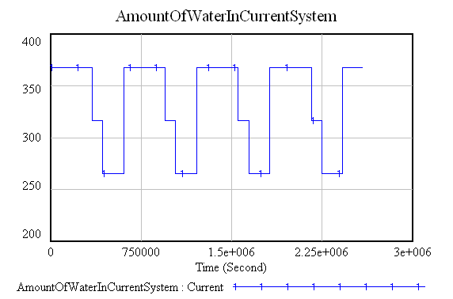

## Living room 

Living room keeps its temperature according to thermostat settings.

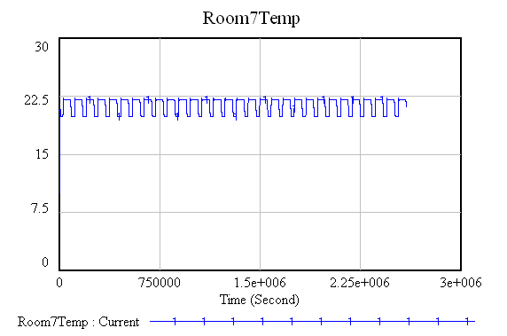 

It\'s heat-up rate changes according to gas-boiler running. 

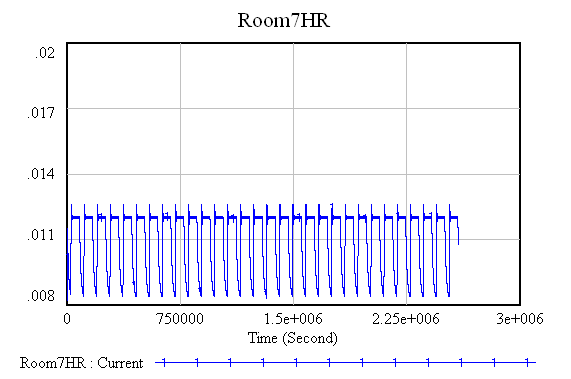

## Room 1 and Room 2 

These rooms are changing its temperature according to pair 1 and pair 2.

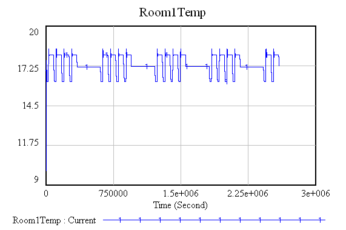 

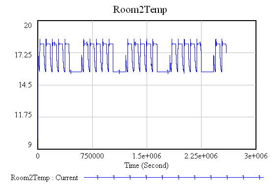

# Conclusion

Heating system has many parameters that changes its behaviour. I was
designing this model to get as accurate data as possible, but when I was
studying about heating system dynamics, I have realized, that scope of
this problematic is so broad that it is not possible to implement this
model with enough accuracy. To make this model more accurate i would
incorporate:

-   Weather statistics and Monte-Carlo generator for base temperature
    modulation
-   Water heat capacity change based on temperature
-   Air circulation inside apartment
-   Water movement inside tubes
-   Room temperature is affected by air circulation and radiator
    placement - a lot
-   Slit-iron heat capacity model
-   Passive sun heating through windows
-   Possibility to have thermostatic radiator valve regulation
-   Equitermal regulation
-   Usage of water for shower a dish cleaning
-   Random generator of opened windows
-   Difference between plastic and wooden windows
-   Etc.

This model is good basic study material but it is very inaccurate. This
model cannot predict amount of gas burned during 4 months. This model
can roughly tell that thermostat has good settings - living room
temperature is higher just about 2 degrees Celsius and that is exactly
what we wanted.

# Code
```
git clone git@github.com:knapovsky/sim-heating-system.git
```